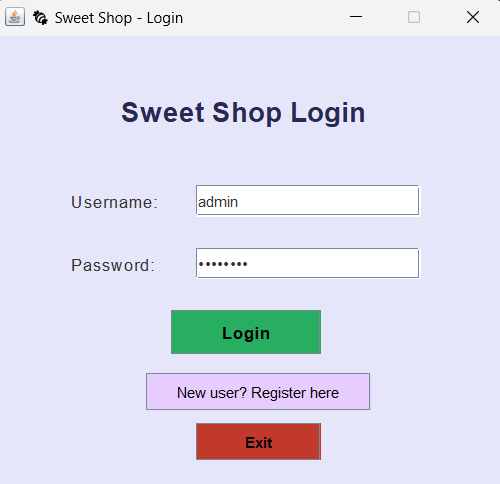
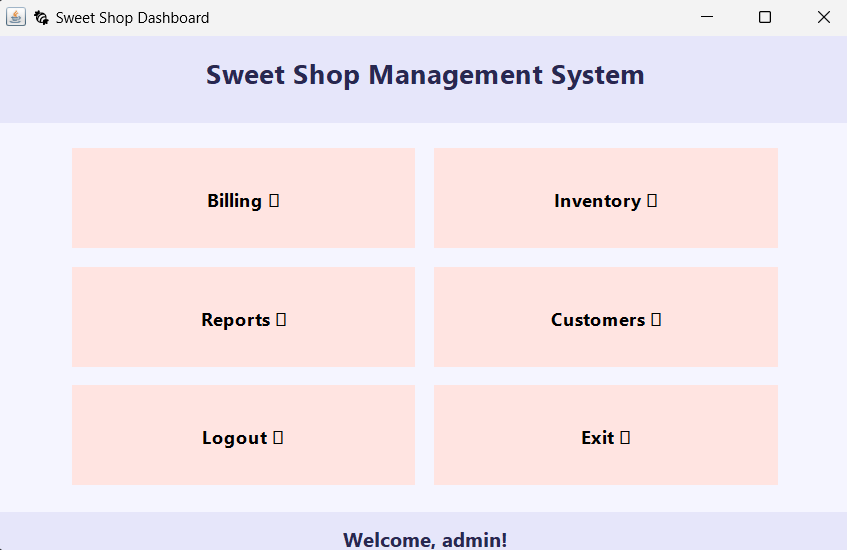
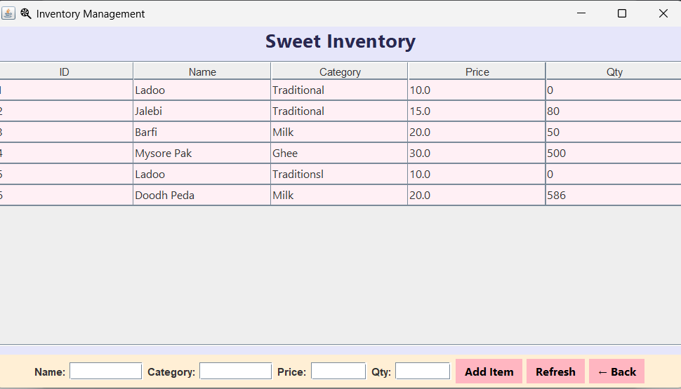
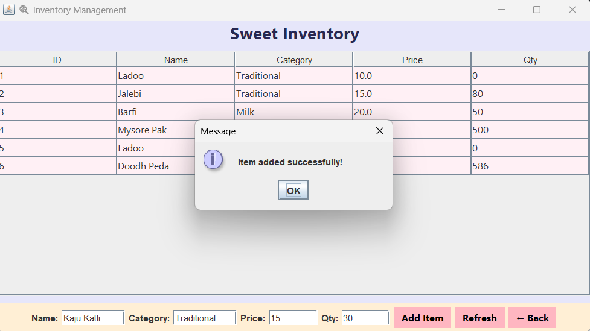
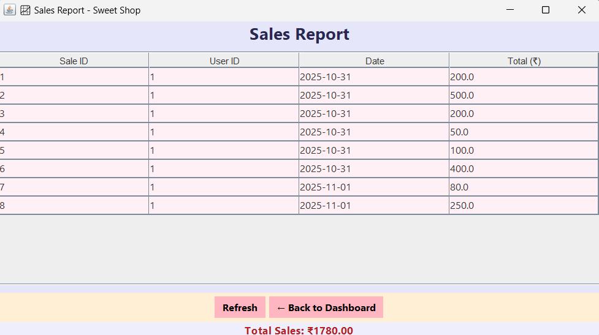
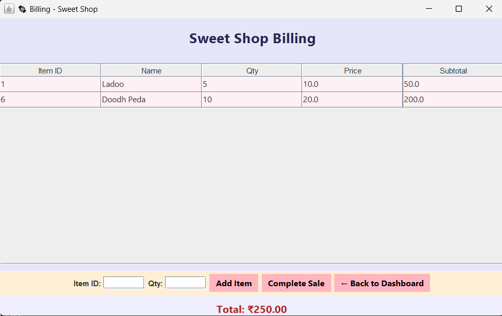
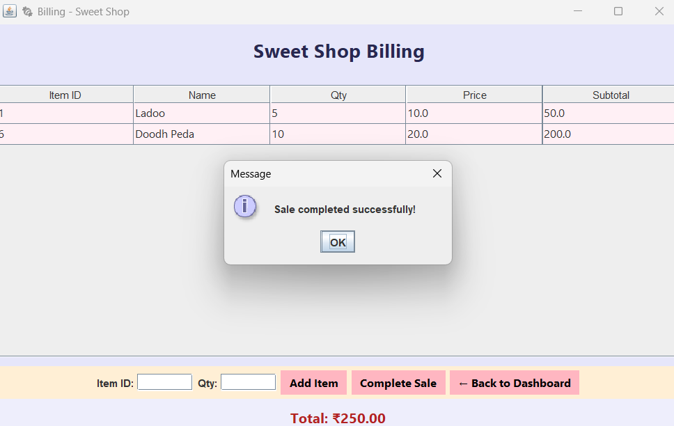
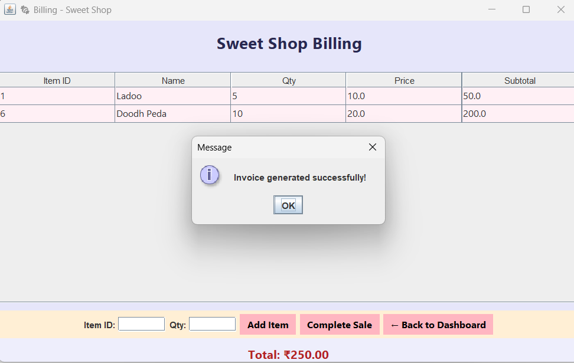

#  Sweet Shop Management System

**Developer:** Varshini  
**Project Type:** AI Kata / SweetShopManagement Project  
**Language:** Java (Swing + SQLite + iText)  
**Type:** Desktop Application

---

## 🧾 1. Project Overview
The **Sweet Shop Management System** is a Java-based desktop application designed to help local sweet shops efficiently manage their daily operations.  
It provides a user-friendly interface to handle **sales, inventory, customers, and staff management**.

### 🎯 Objectives
- Simplify the billing and sales process.  
- Manage sweets inventory and stock levels.  
- Maintain customer and transaction records.  
- Generate PDF invoices for each sale.  
- Enable authentication for admins and cashiers.

---

## 🧠 2. System Architecture
The project follows a **layered MVC structure**:

- **Model Layer** → Defines data entities (e.g., User, SweetItem, Customer, Sale).  
- **DAO Layer** → Handles all database interactions (SQLite).  
- **Service Layer** → Contains the business logic.  
- **UI Layer** → Developed using Java Swing for graphical interaction.  
- **Utility Layer** → Includes DB connection handling and PDF generation.

---

## 🛠️ 3. Technologies Used

| Component | Technology |
|------------|-------------|
| Programming Language | Java (JDK 17 or above) |
| GUI Framework | Java Swing |
| Database | SQLite |
| ORM | JDBC |
| PDF Generation | iText 5.5.13.3 |
| Testing Framework | JUnit |
| Version Control | Git + GitHub |

---

## 🧩 4. Project Features

| Module | Description |
|--------|--------------|
| 🔐 **User Authentication** | Admin and Cashier registration and login |
| 🏠 **Dashboard** | Central navigation hub |
| 💵 **Billing System** | Add items, calculate total, and generate PDF invoice |
| 📦 **Inventory Management** | Manage sweets list and stock levels |
| 📊 **Reports** | Display total sales and performance summaries |
| 👥 **Customer Management** | Add, update, and delete customer details |
| 👤 **User Management** | Admin can manage cashier accounts |
| 🎨 **Aesthetic UI** | Modern layout with pastel color theme |
| 📄 **Invoice Generator** | Exports detailed bill receipts as PDF |

---
## 🖼️ 5. Screenshots
### 🧁 Login Page  


### 🏠 Dashboard  


### 🍬 Inventory Management  



### 👥 Customer Management  


### 💵 Billing  




### 📊 Sales Report  


## ⚙️ 6. Setup Instructions (Local Installation)

### 🔹 Step 1 — Prerequisites
Ensure you have the following installed:

- **Java JDK 17** or later  
- **SQLite** (command-line or DB browser)  
- **Git** (optional, for version control)

Check installations:
```bash
java --version
sqlite3 --version
```

### 🔹 Step 2 — Clone the Repository
```bash
git clone https://github.com/<your-username>/SweetShopManagementSystem.git
cd SweetShopManagementSystem
```

---

## 🤖 7. My AI Usage

This project was developed with the assistance of **ChatGPT (OpenAI’s GPT-5)** to enhance efficiency and understanding during the development process.

### AI Assistance Was Used For:
- Planning the **project architecture** and folder structure.  
- Writing and optimizing **Java Swing UI code** (login, billing, dashboard).  
- Implementing **database interaction logic** (JDBC + SQLite).  
- Generating **boilerplate and repetitive code** (models, DAO, service).  
- Debugging and resolving **compilation and runtime errors**.  
- Drafting **README.md** documentation and **test report summaries**.  
- Enhancing **UI design and layout consistency**.

### However:
- All code was **reviewed, understood, and modified** by *Nagaprasad Salian*.  
- **Logic, structure, and database design** decisions were made manually.  
- The project represents **original work**, with AI used responsibly for support.

**Declaration:**  
> I confirm that this project is my own work. AI tools were used responsibly to assist in learning, debugging, and documentation without compromising originality or understanding.

---
## 🧪 8. Test Report

All test cases were executed successfully using **JUnit 5** (`junit-platform-console-standalone-1.10.2.jar`).

## 🧾 Test Summary

> ℹ️ **Test Execution Results**  
> All tests were executed using **JUnit 5**.  
> Below is a summary of the test outcomes:

| 🧩 **Test Class** | 🧪 **Test Case** | ✅ **Result** |
|-------------------|------------------|----------------|
| **BillingServiceTest** | `testTotalCalculation()` | ✅ Passed |
| **DBConnectionTest** | `testDatabaseConnection()` | ✅ Passed |
| **AuthServiceTest** | `testLoginWithValidUser()` | ✅ Passed |
| **AuthServiceTest** | `testLoginWithInvalidUser()` | ✅ Passed |

> ✅ **Overall Result:** All test cases passed successfully — **100% success rate** 🎯

### 🧰 Test Execution Command
```bash
java -jar lib\junit-platform-console-standalone-1.10.2.jar ^
--class-path "out;lib\sqlite-jdbc-3.50.3.0.jar;lib\itextpdf-5.5.13.3.jar" ^
--scan-class-path

Check installations:
```bash
java --version
sqlite3 --version

...

---

## 📂 Directory Structure

```plaintext
SweetShopManagementSystem/
│
├── lib/
│   ├── sqlite-jdbc-3.50.3.0.jar
│   ├── itextpdf-5.5.13.3.jar
│   └── junit-platform-console-standalone-1.10.2.jar
│
├── src/
│   ├── main/
│   │   ├── java/
│   │   │   └── com/sweetshop/
│   │   │       ├── model/
│   │   │       ├── dao/
│   │   │       ├── service/
│   │   │       ├── ui/
│   │   │       └── util/
│   │   └── resources/
│   │       └── db/
│   │           └── sweetshop.db
│   │
│   └── test/
│       └── java/
│           └── com/sweetshop/
│               ├── AuthServiceTest.java
│               ├── BillingServiceTest.java
│               └── DBConnectionTest.java
│
├── out/                        # Compiled .class files
├── screenshots/                # Application screenshots for README
│   ├── loginPage.png
│   ├── Dashboard.png
│   ├── Inventory.png
│   ├── Inventory Item Addition.png
│   ├── CustomerReport.png
│   ├── Billing Report.png
│   ├── Billing Report sale Completion.png
│   ├── Invoice Generation.png
│   └── Sales Report.png
│
├── README.md

---

## ⚡ Compile the Project
```bash
javac -cp ".;lib\sqlite-jdbc-3.50.3.0.jar;lib\itextpdf-5.5.13.3.jar" ^
-d out src\main\java\com\sweetshop\util\*.java ^
src\main\java\com\sweetshop\model\*.java ^
src\main\java\com\sweetshop\dao\*.java ^
src\main\java\com\sweetshop\service\*.java ^
src\main\java\com\sweetshop\ui\*.java
```

---

## ▶️ Run the Application
```bash
java -cp ".;out;lib\sqlite-jdbc-3.50.3.0.jar;lib\itextpdf-5.5.13.3.jar" com.sweetshop.ui.LoginFrame
```

---

## 🏁 End Notes
- Designed and developed for **academic and learning purposes**.  
- Future updates may include cloud integration and analytics dashboard.

---

**© 2025 Varshini**  
_All rights reserved._
